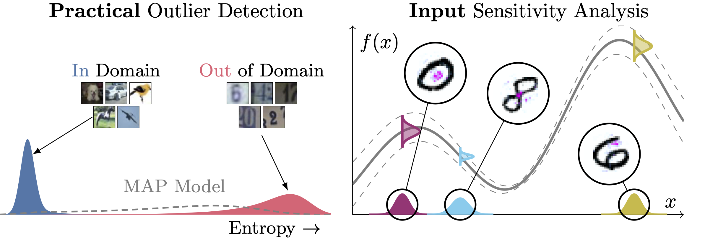

# SUQ: Streamlined Uncertainty Quantification



This repository contains an open-source library implementation of Streamlined Uncertainty Quantification (SFU) used in the paper *Streamlining Prediction in Bayesian Deep Learning* accepted at ICLR 2025.

<table>
<tr>
	<td>
   		<strong> Streamlining Prediction in Bayesian Deep Learning</strong><br>
            Rui Li, Marcus Klasson, Arno Solin, Martin Trapp<br>
		<strong>International Conference on Learning Representations (ICLR 2025)</strong><br>
		<a href="https://arxiv.org/abs/2411.18425"></a>
		<a href="https://github.com/AaltoML/suq"></a>
		<a href="https://aaltoml.github.io/suq"></a>
		</td>
    </tr>
</table>

## SUQ Library
The code will be released soon.


## Citation

```bibtex
@inproceedings{li2025streamlining,
  title = {Streamlining Prediction in Bayesian Deep Learning},
  author = {Rui Li, Marcus Klasson, Arno Solin and Martin Trapp},
  booktitle = {International Conference on Learning Representations ({ICLR})},
  year = {2025}
}
```

## License
This software is provided under the MIT license.
